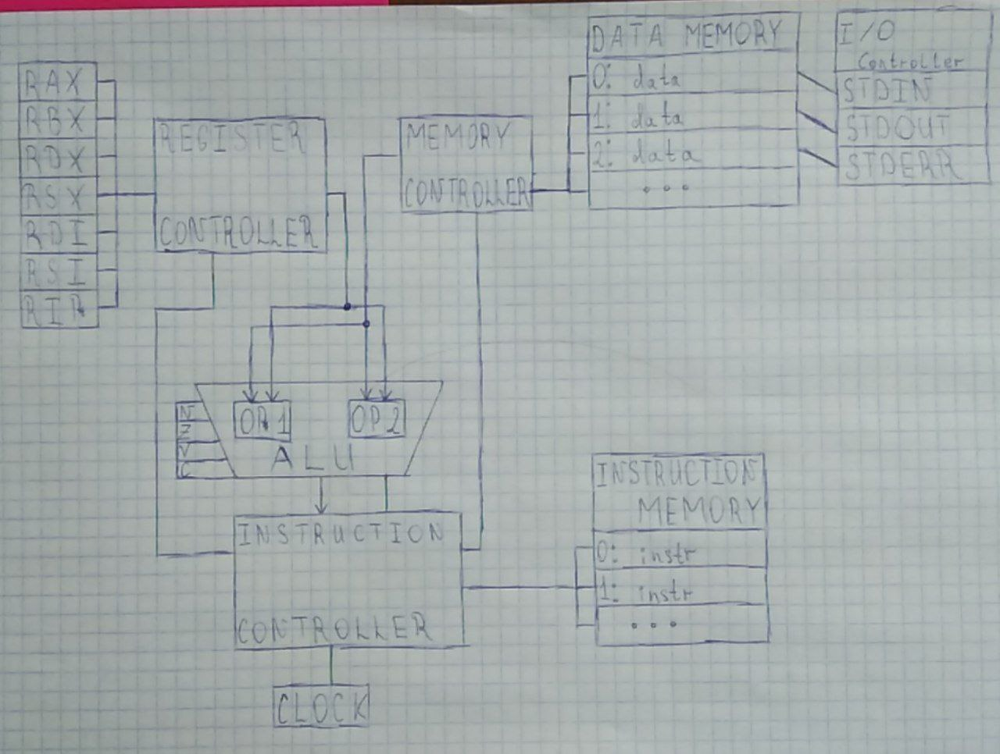

# Лабораторная работа №3. На кончиках пальцев

## Цель

- экспериментальное знакомство с устройством процессоров через моделирование; 
- получение опыта работы с компьютерной системой на нескольких уровнях организации.

### Выполнил

ФИО: Иванов Евгений Дмитриевич<br>
Группа: P33111

### Вариант

`asm | cisc | harv | hw | tick | struct | stream | mem | prob5`

## Язык программирования

### BNF

``` ebnf
<program>       ::= <section_text> | <section_data> <section_text>

<section_data>  ::= "section .data" <line> <data>
<data>          ::= <data_line> 
                  | <data_line> <data>
<data_line>     ::= <var_name> <var_value> <line> <extra_s> 
                  | <extra_s>
<var_name>      ::= <word> ":"
<var_value>     ::= <string> | <number> | <buffer>
<string>        ::= "\'" <word> "\'" 
                  | "\"" <word> "\""
<buffer>        ::= "buf " <number>

<section_text>  ::= "section .text" <line> <instructions>
<instructions>  ::= <instruction> 
                  | <instruction> <instructions>
<instruction>   ::= <label_and_maybe_step> <line> <extra_s>
                  | <step> <line> <extra_s>
<label_and_maybe_step>  ::= <label> | <label> <step>
<label>         ::= "." <word_without_space> ":"
<step>          ::= <command> <operand(-s)>

<word>          ::= <letter_or_digit_or_space> 
                  | <letter_or_digit_or_space> <word>
<word_without_space>        ::= <letter_or_digit> 
                              | <letter_or_digit> <word_without_space>
<letter_or_digit>           ::= <letter> | <digit>
<letter_or_digit_or_space>  ::= <letter> | <digit> | <space>
<extra_s>       ::= <line_or_space> | <line_or_space> <extra_s>
<line_or_space> ::= <line> | <space>
<line>          ::= "\n" 
<spaces>        ::= <space> | <space> <spaces>
<space>         ::= " " | "\t"
<letter>        ::= [a-z] | [A-Z] | [!@#$%^&*()_+-=]
<number>        ::= <digit> | <digit> <number>
<digit>         ::= [0-9]
<comment>       ::= ";" <text>
```

Код выполняется последовательно.

Есть поддержка меток(label). Есть возможность объявить комментарий(после спец. символа ;)

Типизация статическая, слабая.

Код разбит на 2 секции:
- Секция с переменными (начинается с заголовка section .data). Здесь объявляются переменные трёх типов -- строки, числа, массивы.
- Секция кода (начинается с заголовка section .text). Здесь пишется программа с помощью меток и команд. Некоторые команды могут принимать неограниченное число аргументов. Аргументы бывают:
  - Числом (непосредственная передача).
  - Ссылкой на память (прямая адресация). Объявляется при помощи символа #. Сюда же относится обращение к каналам ввода-вывода.
  - Регистром. Обращение к регистру происходит при помощи символа %. 

## Организация памяти
Модель памяти процессора:

1. Память команд. Машинное слово -- не определено. Реализуется списком словарей, описывающих инструкции (одно слово -- одна ячейка).
2. Память данных. Машинное слово -- 32 бита, знаковое. Линейное адресное пространство. Реализуется списком чисел. 

Строки, объявленные пользователем распределяются по памяти один символ на ячейку.

``` text
     Instruction memory
+-----------------------------+
| 00  : add %rax, %rdx        |
| 01  : je end                |
|    ...                      | 
| n   : hlt                   |
|    ...                      |
+-----------------------------+

    Data memory
+-----------------------------+
| 00  : number                |
| 01  : number                |
| 03  : number                |
|    ...                      |
| 98  : number                |
| 99  : number                |
| 100 : number                |
|    ...                      |
+-----------------------------+
```

### Структура программы

``` asm
; секция данных
section .data
    var: (STR) | (NUM) | (buf NUM)

; секция кода
section .text
    [label:] instr [op1, [op2, [...]]]
```

### Секция данных

``` asm
section .data
    HELLO:      "Hello"         ; строка
    NUMBER_HEX: 0xDEAD          ; число в 16 СС
    NUMBER_OCT: 0o1337          ; число в 8 СС
    NUMBER_BIN: 0b10110         ; число в 2 СС
    NUMBER_DEC: -81             ; число в 10 СС
    ARRAY:      buf 20          ; массив из 20 элементов
    NULL_TERM:  0x00
```

### Секция кода

``` asm
section .text
    .print_char:                        ; метка
        MOV %rdx, #ARRAY[%rdi]          ; загрузить
                                        ; в регистр RDX
                                        ; значение ARRAY[RDI]
                                        ; (косвенная адресация) 
        
        CMP %rdx, #NULL_TERM            ; сравнить
                                        ; регистр RDX
                                        ; и переменную
                                        ; (прямая адресация)

        JE .exit                        ; если равны
                                        ; прыгаем на .exit

        MOV #STDOUT, %rdx               ; выводим символ
                                        ; из регистра RDX

        INC %rdi                        ; инкрементируем
                                        ; регистр RDI
        
        JMP .print_char                 ; прыгаем на .print_char
    
    .exit:
        HLT                             ; завершение программы
```

### Система команд

Некоторые инструкции могут принимать неограниченное количество операндов. В таком случае при трансляции сложная инструкция преобразуется в несколько простых.

``` asm
MUL %RAX, #VAR              ; %RAX * #VAR        -> %RAX
MUL %RAX, #VAR, 0xf1        ; #VAR * 0xf1        -> %RAX
MUL %RAX, #VAR, 0xf1, %RDX  ; #VAR * 0xf1 * %RDX -> %RAX
```

### Набор инструкции

| Syntax | Mnemonic   | Comment                                           |
|:-------|:-----------|:--------------------------------------------------|
| `ADD`  | summary    | Сложение операндов и сохранение                   |
| `SUB`  | subtract   | Вычитание операндов и сохранение                  |
| `MUL`  | multiply   | Умножение операндов и сохранение                  |
| `DIV`  | divide     | Деление операндов и сохранение                    |
| `MOD`  | mod_div    | Получение остатка от деления и сохранение         |
| `XOR`  | xor        | Логическое исключающее "ИЛИ" и сохранение         |
| `AND`  | and        | Логическое "И" и сохранение                       |
| `OR`   | or         | Логическое "ИЛИ" и сохранение                     |
| `DEC`  | decrement  | Декремент операнда                                |
| `INC`  | increment  | Инкремент операнда                                |
| `JMP`  | jmp        | Безусловный переход к метке                       |
| `JE`   | je         | Переход, если равенство (Z=1)                     |
| `JNE`  | jne        | Переход, если не равенство (Z=0)                  |
| `JL`   | jl         | Переход, если меньше (N=1)                        |
| `JG`   | jg         | Переход, если больше (N=0, Z=0)                   |
| `JLE`  | jle        | Переход, если меньше или равно (N=1 or Z=1)       |
| `JGE`  | jge        | Переход, если больше или равно (N=0)              |
| `MOV`  | move       | Передать значение из операнда в операнд           |
| `MOVN` | move_to_io | Передать значение в канал вывода или канал ошибок |
| `LDN`  | load_input | Сохранить значение из канала ввода                |
| `CMP`  | compare    | Установка флагов по операции вычитания операндов  |
| `HEL`  | halt       | Остановка программы                               |


## Транслятор

Имеет две стадии:

- Предобработка:
    - Удаление лишних символов (пробелов, табуляций)
    - Удаление комментариев
- Трансляция:
  - Текст -> секции
  - Секция -> строчки
  - Строчка -> метка, инструкция
  - Инструкция -> команда, операнды
  - Операнд -> константа, регистр, адрес, метка

Пример программы, прошедшей трансляцию:

``` python
Program(data=DataSection(var_to_addr={'MAX_DIVIDER': 3,
                                      'STDERR': 2,
                                      'STDIN': 0,
                                      'STDOUT': 1,
                                      'STEP': 4},
                         memory=[0, 0, 0, 20, 2]),
        text=TextSection(labels={'.check_mod': 7,
                                 '.exit': 24,
                                 '.find_number': 15,
                                 '.find_prime': 3,
                                 '.mul_step': 13,
                                 '.next_divider': 18,
                                 '.next_number': 16},
                         lines=[Instruction(name='xor',
                                            operands=[Register(name='RAX'),
                                                      Register(name='RAX')],
                                            sub=[Instruction(name='xor',
                                                             operands=[Register(name='RAX'),
                                                                       Register(name='RAX')],
                                                             sub=[])]),
                                Instruction(name='ldn',
                                            operands=[Address(value=3,
                                                              label='MAX_DIVIDER'),
                                                      Address(value=0,
                                                              label='STDIN')],
                                            sub=[]),
                                Instruction(name='mov',
                                            operands=[Register(name='RAX'),
                                                      Address(value=4,
                                                              label='STEP')],
                                            sub=[]),
                                Instruction(name='inc',
                                            operands=[Register(name='RAX')],
                                            sub=[]),
                                Instruction(name='cmp',
                                            operands=[Register(name='RAX'),
                                                      Address(value=3,
                                                              label='MAX_DIVIDER')],
                                            sub=[]),
                                Instruction(name='jg',
                                            operands=[Label(name='.find_number',
                                                            value=15)],
                                            sub=[]),
                                Instruction(name='mov',
                                            operands=[Register(name='RDX'),
                                                      Constant(value=2)],
                                            sub=[]),
                                Instruction(name='mod',
                                            operands=[Register(name='RBX'),
                                                      Register(name='RAX'),
                                                      Register(name='RDX')],
                                            sub=[Instruction(name='mov',
                                                             operands=[Register(name='RBX'),
                                                                       Register(name='RAX')],
                                                             sub=[]),
                                                 Instruction(name='mod',
                                                             operands=[Register(name='RBX'),
                                                                       Register(name='RDX')],
                                                             sub=[])]),
                                Instruction(name='je',
                                            operands=[Label(name='.find_prime',
                                                            value=3)],
                                            sub=[]),
                                Instruction(name='inc',
                                            operands=[Register(name='RDX')],
                                            sub=[]),
                                Instruction(name='cmp',
                                            operands=[Register(name='RAX'),
                                                      Register(name='RDX')],
                                            sub=[]),
                                Instruction(name='je',
                                            operands=[Label(name='.mul_step',
                                                            value=13)],
                                            sub=[]),
                                Instruction(name='jmp',
                                            operands=[Label(name='.check_mod',
                                                            value=7)],
                                            sub=[]),
                                Instruction(name='mul',
                                            operands=[Address(value=4,
                                                              label='STEP'),
                                                      Register(name='RAX')],
                                            sub=[Instruction(name='mul',
                                                             operands=[Address(value=4,
                                                                               label='STEP'),
                                                                       Register(name='RAX')],
                                                             sub=[])]),
                                Instruction(name='jmp',
                                            operands=[Label(name='.find_prime',
                                                            value=3)],
                                            sub=[]),
                                Instruction(name='xor',
                                            operands=[Register(name='RAX'),
                                                      Register(name='RAX')],
                                            sub=[Instruction(name='xor',
                                                             operands=[Register(name='RAX'),
                                                                       Register(name='RAX')],
                                                             sub=[])]),
                                Instruction(name='add',
                                            operands=[Register(name='RAX'),
                                                      Address(value=4,
                                                              label='STEP')],
                                            sub=[Instruction(name='add',
                                                             operands=[Register(name='RAX'),
                                                                       Address(value=4,
                                                                               label='STEP')],
                                                             sub=[])]),
                                Instruction(name='xor',
                                            operands=[Register(name='RDX'),
                                                      Register(name='RDX')],
                                            sub=[Instruction(name='xor',
                                                             operands=[Register(name='RDX'),
                                                                       Register(name='RDX')],
                                                             sub=[])]),
                                Instruction(name='inc',
                                            operands=[Register(name='RDX')],
                                            sub=[]),
                                Instruction(name='mod',
                                            operands=[Register(name='RBX'),
                                                      Register(name='RAX'),
                                                      Register(name='RDX')],
                                            sub=[Instruction(name='mov',
                                                             operands=[Register(name='RBX'),
                                                                       Register(name='RAX')],
                                                             sub=[]),
                                                 Instruction(name='mod',
                                                             operands=[Register(name='RBX'),
                                                                       Register(name='RDX')],
                                                             sub=[])]),
                                Instruction(name='jne',
                                            operands=[Label(name='.next_number',
                                                            value=16)],
                                            sub=[]),
                                Instruction(name='cmp',
                                            operands=[Register(name='RDX'),
                                                      Address(value=3,
                                                              label='MAX_DIVIDER')],
                                            sub=[]),
                                Instruction(name='je',
                                            operands=[Label(name='.exit',
                                                            value=24)],
                                            sub=[]),
                                Instruction(name='jmp',
                                            operands=[Label(name='.next_divider',
                                                            value=18)],
                                            sub=[]),
                                Instruction(name='movn',
                                            operands=[Address(value=1,
                                                              label='STDOUT'),
                                                      Register(name='RAX')],
                                            sub=[]),
                                Instruction(name='mov',
                                            operands=[Address(value=1,
                                                              label='STDOUT'),
                                                      Constant(value=10)],
                                            sub=[]),
                                Instruction(name='hlt', operands=[], sub=[])]))

```

## Модель процессора


## Апробация

В качестве тестов для machine и translator происходит запуск 3 программ: 

1. [cat](test/examples/cat.pyasm)
2. [hello](test/examples/hello.pyasm)
3. [prob5](test/examples/prob5.pyasm)

Golden тесты можно найти [тут](golden_test.py)

Журналы и коды алгоритмов можно посмотреть в каталоге [test/examples](test/examples).

| ФИО         | алг.  | LoC | code байт | code инстр. | инстр. | такт. | 
|-------------|-------|-----|-----------|-------------|--------|-------|
| Иванов Е.Д. | cat   | 12  | 643       | 6           | 28     | 46    |
| Иванов Е.Д. | hello | 14  | 765       | 7           | 69     | 116   |
| Иванов Е.Д. | prob5 | 43  | 1965      | 27          | 1468   | 3143  |


